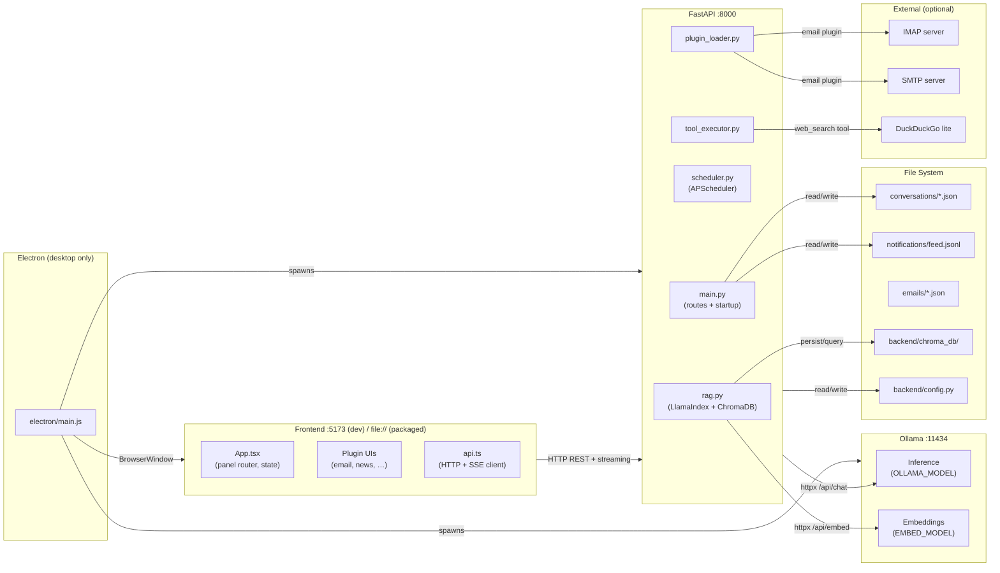
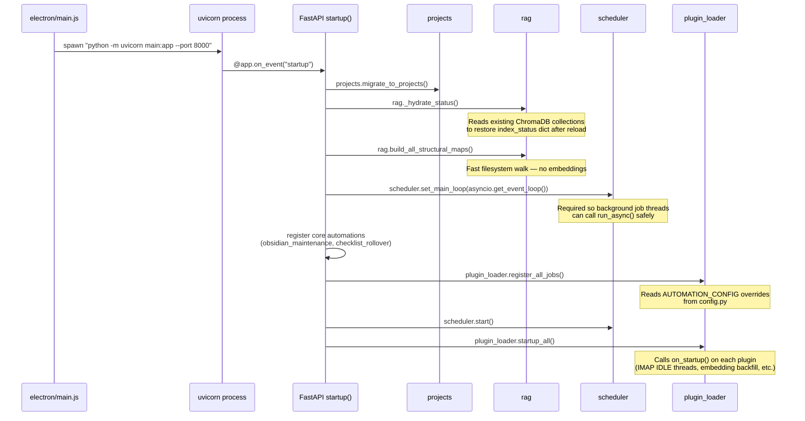
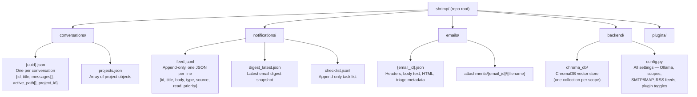

# SHRIMP Architecture Overview

SHRIMP is a fully self-hosted AI productivity assistant. It runs a local LLM (via Ollama) and connects a React frontend to a Python FastAPI backend. All data is stored on disk — no cloud services, no SQL database. It ships as both a web app (`npm run web`) and a packaged Electron desktop app.

---

## System Components



---

## Technology Stack

| Layer | Technology | Version |
|-------|-----------|---------|
| LLM inference | Ollama (local) | configured in `config.py` |
| Embeddings | Ollama `nomic-embed-text` | configured in `config.py` |
| RAG framework | LlamaIndex + ChromaDB | `llama-index-*` packages |
| Backend | Python + FastAPI + uvicorn | Python 3.11+ |
| Background jobs | APScheduler (`BackgroundScheduler`) | |
| Frontend framework | React 19 + TypeScript | |
| Build tool | Vite 8 | |
| CSS | Tailwind CSS 4 + CSS variables | |
| Icons | Lucide React | |
| Code editor (diffs) | Monaco Editor | |
| Desktop shell | Electron 36 | |
| Packaging | electron-builder | AppImage / DMG / NSIS |

---

## Startup Sequence



**Critical ordering note:** `scheduler.set_main_loop()` must be called before `register_all_jobs()` and `startup_all()`. Background threads that call `scheduler.run_async()` rely on the stored event loop reference. Anything that fires before `set_main_loop()` will raise `RuntimeError`.

---

## On-Disk Storage Layout

SHRIMP uses no SQL database. All persistent state is files.



---

## The `config.py` Pattern

All settings are stored as Python variable assignments in `backend/config.py`. When the frontend saves a setting, the backend updates the file using regex substitution:

```python
# Example from main.py write_config()
current = re.sub(
    r'OLLAMA_MODEL = ".*?"',
    f'OLLAMA_MODEL = "{model}"',
    current,
)
config_path.write_text(current)
```

**Why:** Single file, human-readable, restart-safe. No separate database or env files needed for a self-hosted tool.

**Caveat:** The regex substitution is fragile if you add comments or unusual whitespace inside config blocks. Keep config values on their own lines and avoid nested comments inside list/dict literals.

`start.sh` copies `config.example.py` → `config.py` on first run if `config.py` doesn't exist.

---

## Electron Packaging Notes

| Mode | Frontend URL | Backend |
|------|-------------|---------|
| Dev (`npm run web`) | `http://localhost:5173` | uvicorn with `--reload` |
| Electron dev (`npm run electron`) | `http://localhost:5173` | separate uvicorn process |
| Packaged | `file:///…/frontend/dist/index.html` | bundled uvicorn, paths resolved via `__dirname` |

The Electron main process (`electron/main.js`) spawns both `ollama serve` and the backend uvicorn as child processes. It resolves the Python binary and backend directory relative to `process.resourcesPath` when packaged, and relative to the repo root in dev.

Vite is built with `ELECTRON=1` for packaged builds, which sets `base: "./"` so all asset URLs are relative (required for `file://` loading).

---

## Development Quick Start

```bash
# Web mode (browser only, fastest for dev)
npm run web
# → starts backend on :8000 and Vite dev server on :5173

# Electron mode (desktop app with window chrome)
npm run electron
# → builds frontend, starts Electron, spawns backend inside it

# Build packaged app
npm run build [-- --linux | --mac | --win]
# → output in dist-electron/
```

First run: `start.sh` will:
1. Check system deps (python3, node, npm, fuser)
2. Create `backend/.venv` and pip-install requirements
3. Copy `config.example.py` → `config.py` if missing
4. Kill stale processes on ports 8000 and 5173
5. Spawn backend and frontend in background, wait for Ctrl+C
