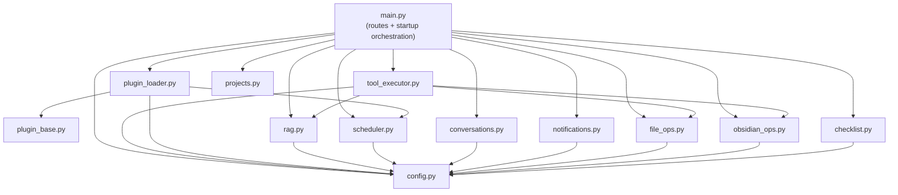
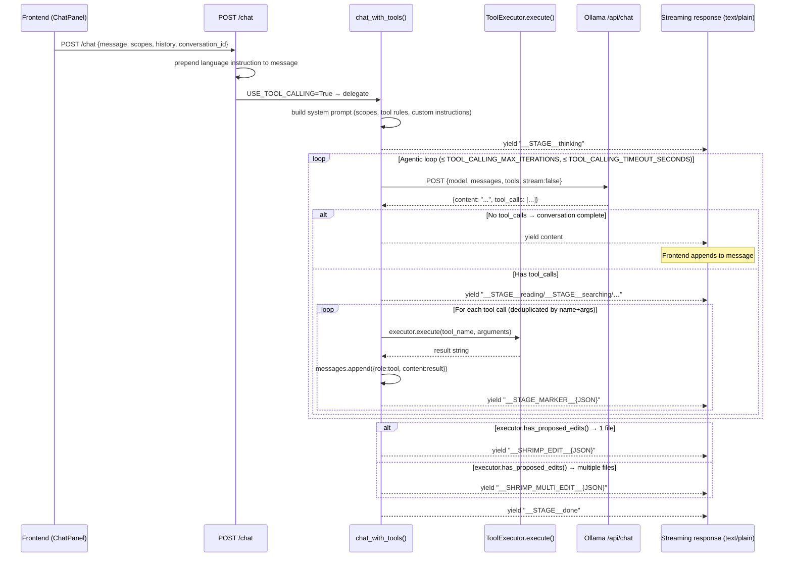
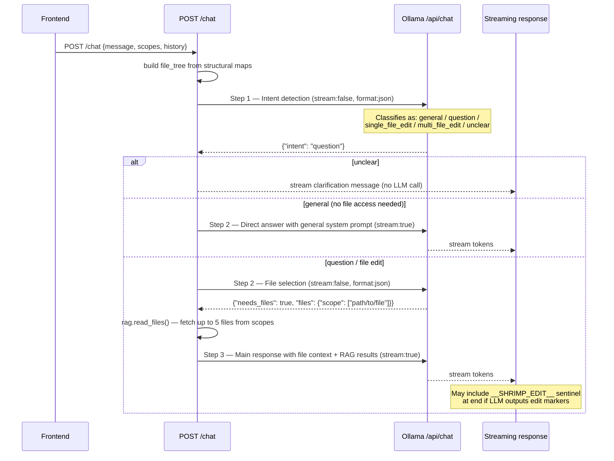
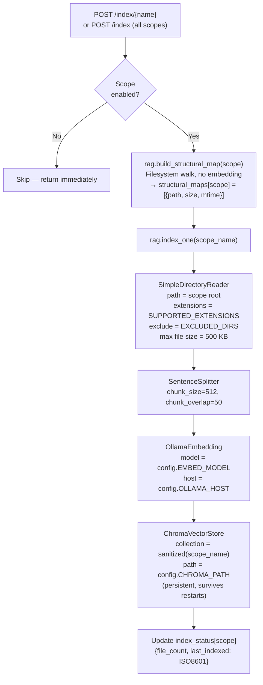
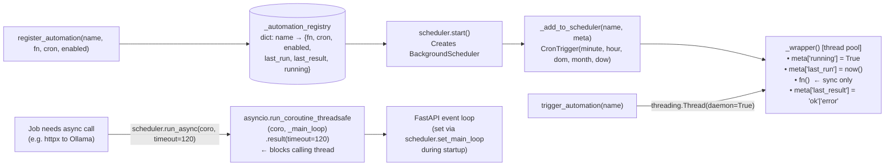
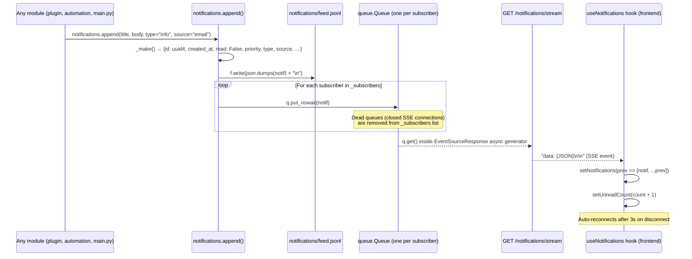
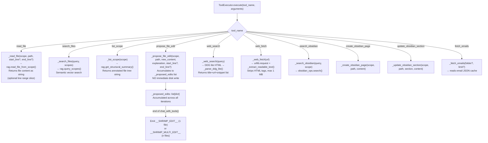

# SHRIMP Backend Reference

All backend code lives in `backend/`. The server is a FastAPI app (`main.py`) with a flat module structure — no subpackages. Plugins live outside in `plugins/` and are loaded dynamically.

---

## Module Dependency Graph

Arrows mean "imports". `config` is omitted from most arrows for clarity — every module imports it.

---

## Module Reference

| Module | Lines | Responsibility | Key exports |
|--------|-------|----------------|-------------|
| `main.py` | ~2756 | FastAPI app, all core routes, startup/shutdown | `app`, `chat_with_tools()`, `write_config()` |
| `tool_executor.py` | ~1046 | Tool implementations for the agentic loop | `ToolExecutor`, `build_tool_definitions()` |
| `plugin_loader.py` | 173 | Plugin discovery, loading, lifecycle | `discover()`, `include_routers()`, `register_all_jobs()`, `startup_all()` |
| `plugin_base.py` | 54 | Base classes for plugin development | `ShrimpPlugin`, `PluginJob` |
| `scheduler.py` | 191 | APScheduler wrapper for named automations | `register_automation()`, `trigger_automation()`, `run_async()` |
| `rag.py` | ~497 | LlamaIndex + ChromaDB vector indexing and search | `index_one()`, `query_scopes()`, `get_structural_summary()`, `build_structural_map()` |
| `conversations.py` | 157 | Conversation persistence (JSON) | `Conversation.load()`, `Conversation.save()`, `list_conversations()` |
| `projects.py` | 129 | Project grouping for conversations | `Project.load_all()`, `migrate_to_projects()` |
| `checklist.py` | 285 | Task checklist (JSONL) | `add_item()`, `toggle_item()`, `rollover_items()` |
| `notifications.py` | 180 | Notification feed + SSE fan-out | `append()`, `subscribe()`, `unsubscribe()` |
| `file_ops.py` | 244 | Scoped file write with path safety | `write_file()`, `validate_path()` |
| `obsidian_ops.py` | 246 | Obsidian vault operations | `list_pages()`, `read_page()`, `search()`, `create_page()`, `update_section()` |
| `config.py` | ~30 | All configuration variables | `OLLAMA_HOST`, `OLLAMA_MODEL`, `WATCHED_DIRS`, `AUTOMATION_CONFIG`, … |
| `automations/obsidian_maintenance.py` | 80 | Weekly vault link/orphan check | `run()` |
| `automations/daily_digest.py` | 240 | Morning email digest | `run()` |
| `automations/email_triage.py` | 68 | 15-min email triage polling fallback | `run()` |

---

## Chat Pipeline: Tool-Calling Path

This is the default path when `config.USE_TOOL_CALLING = True` (the default).

---

## Chat Pipeline: Prompt-Chaining Fallback

Used when `config.USE_TOOL_CALLING = False`. More constrained but lower model requirements.

---

## The Sentinel Protocol

The streaming response from `/chat` is plain text (`text/plain`). Special sentinel strings are embedded inline. `ChatPanel.tsx` scans each incoming chunk for these markers before displaying text.

| Sentinel | Direction | Meaning |
|----------|-----------|---------|
| `__STAGE__thinking` | backend → frontend | Show "Thinking…" spinner |
| `__STAGE__reading` | backend → frontend | Show "Reading files…" spinner |
| `__STAGE__searching` | backend → frontend | Show "Searching…" spinner |
| `__STAGE__finding` | backend → frontend | Show "Finding files…" spinner |
| `__STAGE__planning` | backend → frontend | Show "Planning edits…" spinner |
| `__STAGE__browsing` | backend → frontend | Show "Browsing web…" spinner |
| `__STAGE__done` | backend → frontend | Hide spinner, finalize message |
| `__STAGE_MARKER__{JSON}` | backend → frontend | Per-tool-call metadata (stripped from display, used for tool call summary chips) |
| `__SHRIMP_EDIT__{JSON}` | backend → frontend | Single-file diff — opens `DiffPanel` |
| `__SHRIMP_MULTI_EDIT__{JSON}` | backend → frontend | Multi-file diff — opens `MultiFileDiffPanel` |

`__STAGE__*` tokens are stripped from the displayed message. `__STAGE_MARKER__` tokens are stripped and parsed for the tool-call history. `__SHRIMP_EDIT__` and `__SHRIMP_MULTI_EDIT__` are stripped and trigger the diff UI.

---

## RAG Indexing Pipeline

**Structural map vs. vector index:** The structural map is built first and is always up to date (just a directory walk). It powers `list_scope` tool calls and the file tree display. The vector index is built separately (slow, requires Ollama running) and powers `search_files` semantic search.

**Supported file types:** `.md .py .ts .tsx .js .jsx .json .yaml .yml .toml .txt .sh .rs .go .java .c .cpp .h`

---

## Scheduler & Automation Registry

**Key constraint:** All `PluginJob.fn` callables must be synchronous (`def`, not `async def`). APScheduler runs them in a thread pool. Use `scheduler.run_async(coro)` to bridge into async code (e.g., `httpx` calls to Ollama). Do **not** call `asyncio.run()` inside a job — it creates a second event loop, which breaks socket binding on this system.

---

## Notifications SSE Fan-Out

---

## ToolExecutor Routing

**Security:** All file-reading tools validate that the resolved path stays within the scope root (`file_ops.validate_path()`). `propose_file_edit` never writes directly — it only accumulates. Writes happen only when the user clicks "Apply" in the diff UI, which calls `POST /file/apply`.

---

## `file_ops` Security Boundary

`file_ops.py` is the only module allowed to write to scoped directories.

- `validate_path(scope_root, path)` — ensures the final path (after symlink resolution) does not escape `scope_root`. Raises `ValueError` on traversal attempts.
- `write_file(scope, path, content)` — validates path, writes atomically (temp file + rename on supported systems), creates parent dirs as needed.
- Any tool or route that writes user-visible files must go through `file_ops.write_file()`, never `Path.write_text()` directly.

---

## API Route Index

### Health & Plugins
| Method | Path | Handler | Notes |
|--------|------|---------|-------|
| GET | `/health` | `health()` | Returns `{status, model}` |
| GET | `/api/plugins` | `list_plugins()` | All manifests + enabled state |
| PUT | `/api/plugins/{plugin_id}` | `update_plugin()` | Toggle enabled, persists to config.py |

### Debug
| Method | Path | Handler | Notes |
|--------|------|---------|-------|
| GET | `/debug/prompt` | `debug_prompt()` | Scope + file tree preview |
| GET | `/debug/find` | `debug_find()` | Find file in scope |
| POST | `/debug/prompt` | `debug_post_prompt()` | System prompt + augmented message preview |

### Chat
| Method | Path | Handler | Notes |
|--------|------|---------|-------|
| POST | `/chat` | `chat()` | Routes to `chat_with_tools()` or prompt-chaining based on `USE_TOOL_CALLING` |

### Scopes
| Method | Path | Handler | Notes |
|--------|------|---------|-------|
| GET | `/scopes` | `get_scopes()` | List `WATCHED_DIRS` |
| GET | `/settings/scopes` | `get_settings_scopes()` | Alias for `/scopes` |
| POST | `/settings/scopes` | `update_scopes()` | Update scopes + model, write config.py |
| DELETE | `/settings/scopes/{name}` | `delete_scope()` | Remove scope |
| POST | `/scopes/{name}/generate-description` | `generate_scope_description()` | LLM-generated description |

### Conversations
| Method | Path | Handler | Notes |
|--------|------|---------|-------|
| GET | `/conversations` | `list_conversations()` | Metadata only (no messages) |
| GET | `/conversations/{id}` | `get_conversation()` | Full conversation with messages |
| POST | `/conversations` | `save_conversation()` | Create or update |
| DELETE | `/conversations/{id}` | `delete_conversation()` | |
| POST | `/conversations/{id}/title` | `update_title()` | |
| POST | `/conversations/{id}/project` | `move_conversation()` | Assign to project |

### Projects
| Method | Path | Handler | Notes |
|--------|------|---------|-------|
| GET | `/projects` | `list_projects()` | |
| POST | `/projects` | `create_project()` | |
| PUT | `/projects/{id}` | `update_project()` | |
| DELETE | `/projects/{id}` | `delete_project()` | |

### Models (Ollama)
| Method | Path | Handler | Notes |
|--------|------|---------|-------|
| GET | `/models` | `list_models()` | Queries Ollama |
| POST | `/settings/model` | `set_model()` | Updates config.py |
| POST | `/models/pull` | `pull_model()` | Streaming progress |
| DELETE | `/models/{model:path}` | `delete_model()` | |

### Indexing (RAG)
| Method | Path | Handler | Notes |
|--------|------|---------|-------|
| POST | `/index` | `index_all()` | Background thread |
| GET | `/index/status` | `index_status_route()` | Per-scope status |
| POST | `/index/structural` | `build_structural()` | Structural maps only (no embedding) |
| POST | `/index/{name}` | `index_one_route()` | Single scope |
| GET | `/index/{name}/stream` | `index_stream()` | SSE progress stream |

### Files
| Method | Path | Handler | Notes |
|--------|------|---------|-------|
| GET | `/file` | `read_file()` | Query params: `scope`, `path` |
| POST | `/file/apply` | `apply_file_edit()` | Applies proposed edits, calls `file_ops.write_file()` |

### Settings
| Method | Path | Handler | Notes |
|--------|------|---------|-------|
| GET/POST | `/settings/ctx` | context window size | Writes `NUM_CTX` to config.py |
| GET/POST | `/settings/custom-instructions` | global custom instructions | |
| GET/POST | `/settings/web-search` | web search toggle | |
| GET/POST | `/settings/theme` | UI theme name | |
| GET/POST | `/settings/language` | UI language | |
| GET/POST | `/settings/ollama-host` | Ollama host mode + URL | |

### Notifications
| Method | Path | Handler | Notes |
|--------|------|---------|-------|
| GET | `/notifications` | `list_notifs()` | Query: `limit` |
| GET | `/notifications/count` | `notif_count()` | Unread count |
| POST | `/notifications/{id}/dismiss` | `dismiss_notif()` | Mark read |
| DELETE | `/notifications/{id}` | `delete_notif()` | |
| GET | `/notifications/stream` | `notification_stream()` | SSE (EventSourceResponse) |

### Automations
| Method | Path | Handler | Notes |
|--------|------|---------|-------|
| GET | `/automations` | `list_automations()` | All registered automations with status |
| POST | `/automations/{name}/run` | `trigger_automation_route()` | Manual fire-and-forget |
| POST | `/automations/{name}` | `update_automation()` | Update cron / enabled; writes config.py |

### Obsidian
| Method | Path | Handler | Notes |
|--------|------|---------|-------|
| GET | `/obsidian/pages` | list pages | Query: `scope` |
| GET | `/obsidian/pages/{path}` | get page | |
| POST | `/obsidian/pages` | create page | |
| PUT | `/obsidian/pages/{path}` | update section | |
| POST | `/obsidian/search` | search vault | |

### Checklist
| Method | Path | Handler | Notes |
|--------|------|---------|-------|
| GET | `/checklist` | list items | Query: `include_completed` |
| POST | `/checklist` | add item | |
| POST | `/checklist/{id}/toggle` | mark done/undone | |
| DELETE | `/checklist/{id}` | delete | |
| POST | `/checklist/clear-completed` | bulk clear | |
| POST | `/checklist/rollover` | roll overdue forward | |
| PUT | `/checklist/{id}` | update item text/date | |
| POST | `/checklist/triage` | LLM triage emails → checklist | |

### Email Plugin (`/plugins/email/…`)
See `plugins/email/backend/__init__.py` — 40+ routes covering: config, inbox, search, flags, archive, trash, move, triage (streaming), digest, SMTP send, folder listing, attachment download, sync state.

### News Plugin (`/plugins/news/…`)
| Method | Path | Notes |
|--------|---------|-------|
| GET/POST | `/plugins/news/feeds` | RSS feed list |
| GET/POST | `/plugins/news/interests` | Interest text + strictness |
