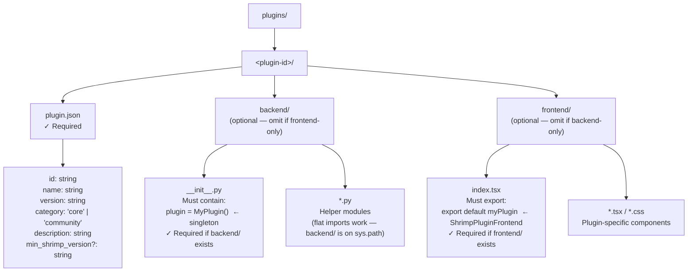
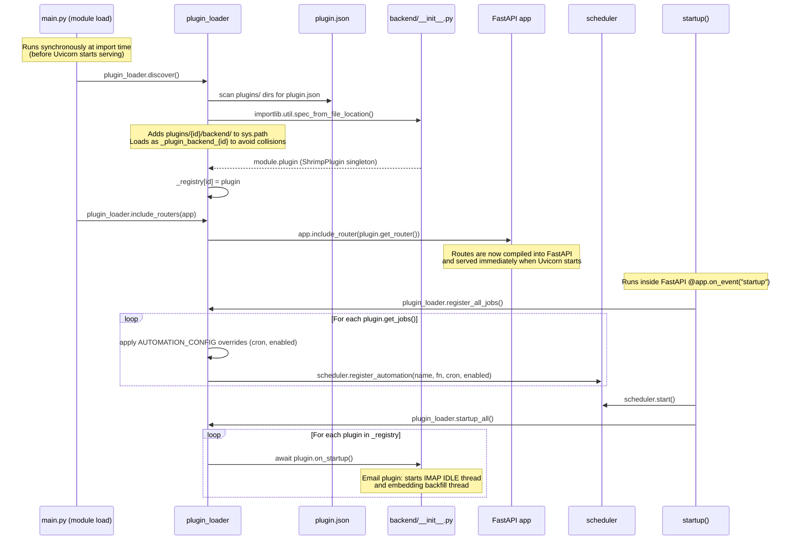

# SHRIMP Plugin System

Plugins extend SHRIMP with new panels, nav items, settings sections, dashboard cards, and scheduled automations. Each plugin lives in `plugins/<id>/` and can have a backend (Python), a frontend (TypeScript/React), or both.

---

## Plugin Directory Layout



---

## Plugin Lifecycle



---

## Backend Contract

Every backend plugin must subclass `ShrimpPlugin` from `plugin_base.py` and expose a module-level `plugin` singleton.

```python
# plugins/myplugin/backend/__init__.py
from plugin_base import ShrimpPlugin, PluginJob
from fastapi import APIRouter

router = APIRouter(prefix="/plugins/myplugin", tags=["myplugin"])

@router.get("/hello")
async def hello():
    return {"message": "Hello from myplugin!"}

class MyPlugin(ShrimpPlugin):
    id = "myplugin"
    name = "My Plugin"
    category = "community"   # or "core"

    def get_router(self) -> APIRouter:
        return router

    async def on_startup(self) -> None:
        # Start background threads here (IMAP sync, polling, etc.)
        pass

    async def on_shutdown(self) -> None:
        # Clean up threads/connections here
        pass

    def get_jobs(self) -> list[PluginJob]:
        return [
            PluginJob(
                name="myplugin_daily",
                fn=my_sync_job,        # MUST be def, not async def
                cron="0 9 * * *",      # 5-field: minute hour dom month dow
                description="Run my plugin job daily at 9am UTC",
                enabled_default=True,
            )
        ]

plugin = MyPlugin()   # ← This exact name is required
```

### `ShrimpPlugin` API

| Method | Required | Description |
|--------|----------|-------------|
| `id: str` | Yes | Must match `plugin.json` `id` field |
| `name: str` | Yes | Human-readable display name |
| `category: str` | No | `"core"` or `"community"` (default: `"community"`) |
| `get_router()` | No | Return FastAPI `APIRouter` or `None`. Mounted at startup. |
| `on_startup()` | No | `async def` — called once during FastAPI startup |
| `on_shutdown()` | No | `async def` — called once during FastAPI shutdown |
| `get_jobs()` | No | Return `list[PluginJob]` for the scheduler |

### `PluginJob` Fields

| Field | Type | Description |
|-------|------|-------------|
| `name` | `str` | Unique across all automations (core + all plugins) |
| `fn` | `Callable` | **Sync only.** APScheduler calls this in a thread. Use `scheduler.run_async()` for async operations. |
| `cron` | `str` | 5-field cron: `minute hour dom month dow` |
| `description` | `str` | Shown in AutomationsPanel UI |
| `enabled_default` | `bool` | Default enabled state **before** `AUTOMATION_CONFIG` overrides are applied |

> **Note on `enabled_default`:** This is only the initial value. Once the user enables/disables the job via the UI, the state is written to `AUTOMATION_CONFIG` in `config.py` and takes precedence permanently.

---

## Frontend Contract

Each plugin's `frontend/index.tsx` must export a default object implementing `ShrimpPluginFrontend` (defined in `frontend/src/plugins/types.ts`).

```typescript
// plugins/myplugin/frontend/index.tsx
import type { ShrimpPluginFrontend } from "@core/plugins/types";
import { Zap } from "lucide-react";

const myPlugin: ShrimpPluginFrontend = {
    id: "myplugin",                          // Must match plugin.json id
    category: "community",
    navItem: {
        Icon: Zap,
        label: "My Plugin",
        useBadge: useMyBadgeCount,           // Optional hook returning number
    },
    PanelComponent: MyPanelComponent,        // Rendered when nav item active
    DashboardCards: [MyDashboardCard],       // Rendered in DashboardHome
    SettingsSection: MySettingsSection,      // Rendered in SettingsModal
};

export default myPlugin;
```

### `ShrimpPluginFrontend` Interface

| Field | Type | Description |
|-------|------|-------------|
| `id` | `string` | Must match `plugin.json` id |
| `category` | `"core" \| "community"` | `"core"` gets a dedicated settings tab; `"community"` appears under the Plugins tab |
| `navItem` | `PluginNavItem` | Adds a button to the nav rail |
| `navItem.Icon` | `React.ComponentType` | Lucide icon or any component accepting `{ size?: number }` |
| `navItem.label` | `string` | Tooltip / accessibility label |
| `navItem.useBadge` | `() => number` | Hook returning badge count (≥1 shows badge) |
| `PanelComponent` | `React.ComponentType<{ onNavigate, params? }>` | Main panel when nav item active |
| `DashboardCards` | `React.ComponentType<{ onNavigate }>[]` | Zero or more dashboard cards |
| `SettingsSection` | `React.ComponentType` | Settings UI (no props) |

`onNavigate(panel, emailId?, conversationId?)` lets plugins navigate to other panels.

**Plugin loading:** `PluginProvider` (in `frontend/src/main.tsx`) calls `loadPlugins(pluginIds)` which uses `import.meta.glob("../../plugins/*/frontend/index.tsx")` to discover all plugin frontends. Enabled state comes from `GET /api/plugins`.

---

## The `run_async` Bridge

All plugin automation jobs must be synchronous functions. When a job needs to call async code (e.g., HTTP requests to Ollama), use `scheduler.run_async()`:

```python
import scheduler as _scheduler

def run():
    # ✓ Correct — use run_async() for async calls
    result = _scheduler.run_async(
        _call_llm("summarize this"),
        timeout=120,
    )
    process(result)

async def _call_llm(prompt: str) -> str:
    async with httpx.AsyncClient() as client:
        resp = await client.post(...)
    return resp.json()["message"]["content"]
```

**Why not `asyncio.run()`?**  
`asyncio.run()` creates a new event loop on the current thread. On this system, creating a second loop breaks 0.0.0.0 socket binding for the existing FastAPI event loop. `scheduler.run_async()` schedules the coroutine on the **existing** FastAPI event loop via `asyncio.run_coroutine_threadsafe()` and blocks the thread until it completes.

**The loop reference** is set during startup:
```python
# main.py startup()
scheduler.set_main_loop(asyncio.get_event_loop())
```
This must happen before any job threads are started.

---

## `AUTOMATION_CONFIG` Override System

The scheduler's `register_all_jobs()` applies overrides from `config.py` before registering each job:

```python
# plugin_loader.py
overrides = getattr(config, "AUTOMATION_CONFIG", {}).get(job.name, {})
cron = overrides.get("cron", job.cron)
enabled = overrides.get("enabled", job.enabled_default)
```

`AUTOMATION_CONFIG` in `config.py`:
```python
AUTOMATION_CONFIG: dict = {
    "email_triage": {"cron": "*/15 * * * *", "enabled": True},
    "daily_digest": {"cron": "0 8 * * *",    "enabled": True},
    "news_digest":  {"cron": "0 9 * * *",    "enabled": True},
}
```

When the user changes a schedule in the AutomationsPanel, the backend writes the new values to this dict via `POST /automations/{name}`, using regex substitution on `config.py`. The change persists across restarts.

---

## Email Plugin Deep-Dive

**Location:** `plugins/email/`  
**Category:** `core`  
**Backend modules:** `__init__.py`, `email_client.py`, `email_smtp.py`, `email_processor.py`, `email_sync.py`, `daily_digest.py`, `email_triage.py`

### Architecture

```
EmailPlugin
├── get_router()      → 40+ routes under /plugins/email/
├── on_startup()
│   ├── email_sync.start()    → IMAP IDLE thread (real-time push)
│   ├── email_sync.start_periodic_sync()  → 5-min polling thread
│   └── _start_embed_backfill_thread()    → embeds unembedded emails
└── get_jobs()
    ├── PluginJob("email_triage", run, "*/15 * * * *")
    │   └── email_processor.auto_triage_email() via run_async()
    └── PluginJob("daily_digest", run, "0 8 * * *")
        └── _call_llm() + notifications.append() via run_async()
```

### Key Routes
- `GET /plugins/email/inbox` — paginated inbox with triage metadata
- `POST /plugins/email/{id}/triage` — streaming LLM triage for a single email
- `GET /plugins/email/flagged` — flagged emails for dashboard card
- `POST /plugins/email/send` — SMTP send via `email_smtp.py`
- `GET/POST /plugins/email/config` — IMAP settings (written to config.py)
- `GET/POST /plugins/email/smtp/config` — SMTP settings

### Data Flow
1. IMAP IDLE thread receives push notifications → `email_client.fetch_incremental()`
2. New emails cached as `emails/{id}.json`
3. `email_triage` job runs every 15 min → `email_processor.auto_triage_email()` calls Ollama to classify urgency + extract action items
4. Triage metadata merged into email JSON
5. `daily_digest` job at 8am → summarizes all high-priority action items → `notifications.append()`

---

## News Plugin Deep-Dive

**Location:** `plugins/news/`  
**Category:** `community`  
**Backend modules:** `__init__.py`, `news_digest.py`

### Architecture

```
NewsPlugin
├── get_router()  → 4 routes under /plugins/news/
│   ├── GET/POST /feeds       (RSS feed list)
│   └── GET/POST /interests   (interest text + strictness)
└── get_jobs()
    └── PluginJob("news_digest", run, "0 9 * * *")
        └── news_digest.run() — fetches RSS, filters by interests,
                                adds items to checklist, sends notification
```

### Key Logic (`news_digest.py`)
1. Fetch each enabled RSS feed via `urllib`
2. Parse `<item>` entries (title, link, description, pubDate)
3. Call Ollama with the feed items and `NEWS_INTERESTS` to filter by relevance
4. Add filtered items to the daily checklist via `checklist.add_item()`
5. Emit a summary notification via `notifications.append()`

`enabled_default` is `bool(getattr(config, "RSS_FEEDS", []))` — the job enables itself if there are any feeds configured.

---

## Writing a New Plugin

1. **Create directory:** `mkdir -p plugins/myplugin/{backend,frontend}`

2. **Write `plugin.json`:**
   ```json
   {
     "id": "myplugin",
     "name": "My Plugin",
     "version": "0.1.0",
     "category": "community",
     "description": "What this plugin does"
   }
   ```

3. **Write `backend/__init__.py`:** Subclass `ShrimpPlugin`, implement desired methods, export `plugin = MyPlugin()` singleton.

4. **Write `frontend/index.tsx`:** Create `ShrimpPluginFrontend` object and `export default` it.

5. **Import and use `config`:** Any plugin config should live in `backend/config.py` (the shared config file). Add your config keys there and use `_write_my_config()` helpers following the regex-substitution pattern in the email plugin.

6. **Background threads:** Start them in `on_startup()`. Stop them in `on_shutdown()`. Make them daemon threads (`threading.Thread(daemon=True)`) so they don't prevent clean shutdown.

7. **Async calls in jobs:** Always use `scheduler.run_async(coro, timeout=N)` inside sync job functions. Never `asyncio.run()`.

8. **Register in `config.py`:** Add your job to `AUTOMATION_CONFIG` with a default cron and enabled state if you want it configurable from the UI.
